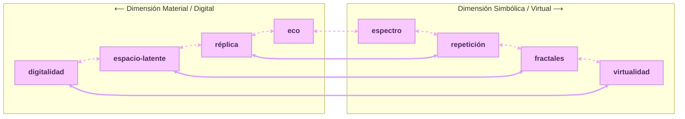

```mermaid
flowchart LR
    %% Nodos principales
    A[digitalidad]:::n <--> B[espacio-latente]:::n
    B <--> C[réplica]:::n
    C <--> D[eco]:::n
    D <--> E[espectro]:::n
    E <--> F[repetición]:::n
    F <--> G[fractales]:::n
    G <--> H[virtualidad]:::n
    H <--> A
    C <--> F
    B <--> G

    %% División por mitades (ajustada)
    subgraph L[⟵ Dimensión Material / Digital]
        direction LR
        A
        B
        C
        D
    end

    subgraph R[Dimensión Simbólica / Virtual ⟶]
        direction LR
        E
        F
        G
        H
    end

    %% Estilos
    classDef n fill:#f8c8ff,stroke:#d1a0e0,stroke-width:2px,color:#4b2b60,font-weight:bold;

    %% Animaciones simuladas mediante estilos alternos y flechas punteadas
    linkStyle 0,1,2,3,4,5,6 stroke:#f5a0ff,stroke-width:2px,stroke-dasharray:5 5;
    linkStyle 7,8 stroke:#d8a0ff,stroke-width:3px;
    linkStyle 9 stroke:#d8a0ff,stroke-width:3px;


```

  

